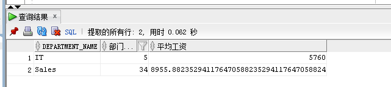
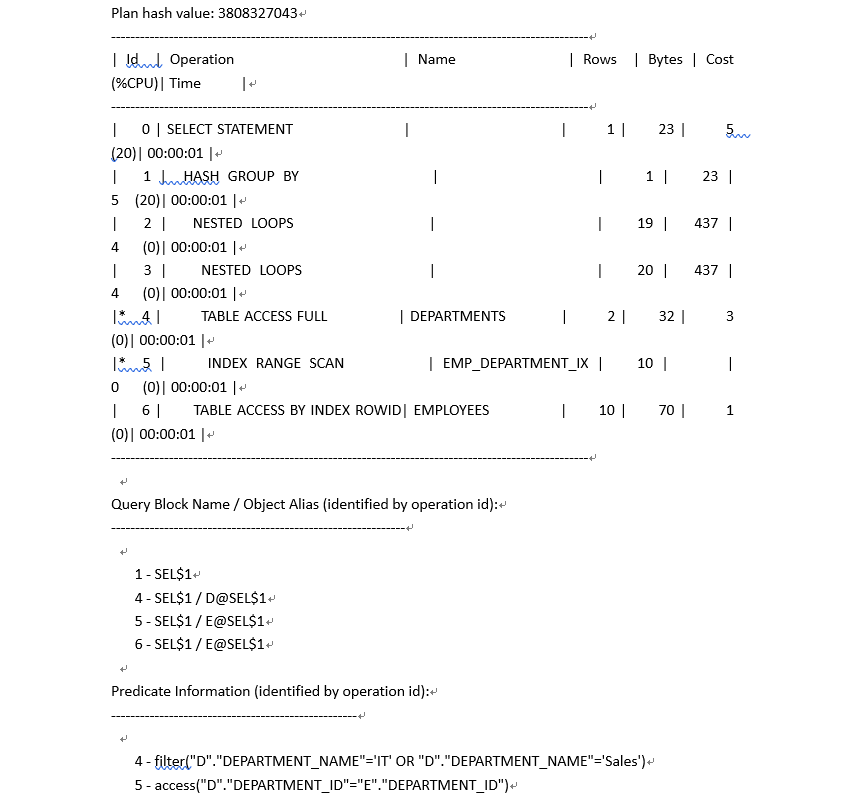
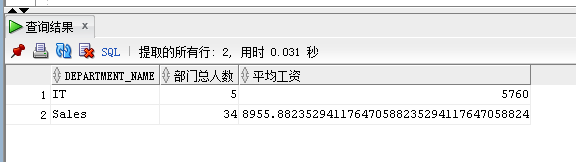
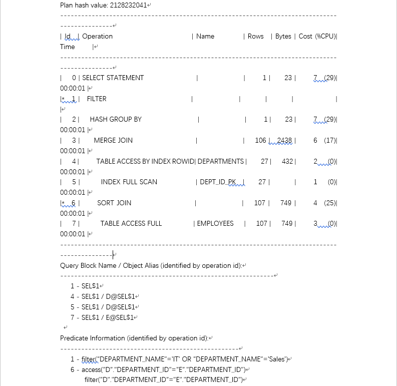
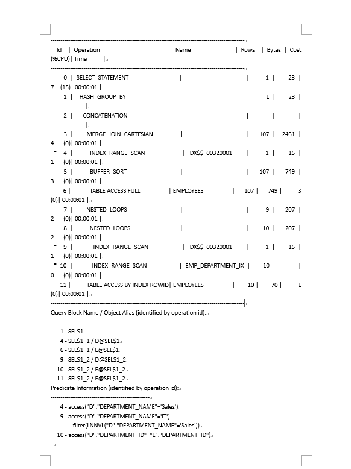
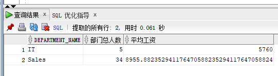

# 实验一：分析SQL执行计划，执行SQL语句的优化指导
## 实验内容：
*   对Oracle12c中的HR人力资源管理系统中的表进行查询与分析。
*   首先运行和分析教材中的样例：本训练任务目的是查询两个部门('IT'和'Sales')的部门总人数和平均工资，以下两个查询的结果是一样的。但效率不相同。
*   设计自己的查询语句，并作相应的分析，查询语句不能太简单。
## 教材中的查询语句
查询1：
```SQL
SELECT d.department_name,count(e.job_id)as "部门总人数",
avg(e.salary)as "平均工资"
from hr.departments d,hr.employees e
where d.department_id = e.department_id
and d.department_name in ('IT','Sales')
GROUP BY department_name;
```
执行结果：



分析：

*   执行计划



*   其中，Cost=5，Rows=20，Predicate information(谓词信息)中又一次索引搜索access，一次全表搜索filter。
*   优化建议：sqldeveloper的优化指导工具给出了相应的优化建议，通过创建一个或多个索引可以改进此语句的执行计划。

查询2：
```SQL
SELECT d.department_name,count(e.job_id)as "部门总人数",
avg(e.salary)as "平均工资"
FROM hr.departments d,hr.employees e
WHERE d.department_id = e.department_id
GROUP BY department_name
HAVING d.department_name in ('IT','Sales');
```
执行结果：



分析：

*   执行计划



*   其中：Cost=7，Rows=106，Predicate information（谓词信息）中又一次索引搜索access，两次全表搜索filter。
*   优化建议：sqldeveloper的优化指导工具未给出优化建议。

比较：
总体来看，查询1比查询2更优，这是因为查询1除了"consistent gets=10"比查询2的"consistent gets=9"稍差，其他参数都优于查询2。

## 自定义查询
```SQL
SELECT d.department_name,count(e.job_id)as "部门总人数",
avg(e.salary)as "平均工资"
FROM hr.departments d,hr.employees e
WHERE d.department_id = e.department_id
and d.department_name = 'IT' or d.department_name = 'Sales'
GROUP BY department_name
```
分析：

*   执行计划



执行结果：



*   优化建议：在进行连接的时候会造成开销很大的笛卡尔积操作，考虑从此语句中移去断开连接的表或视图, 或者添加引用它的联接条件。。