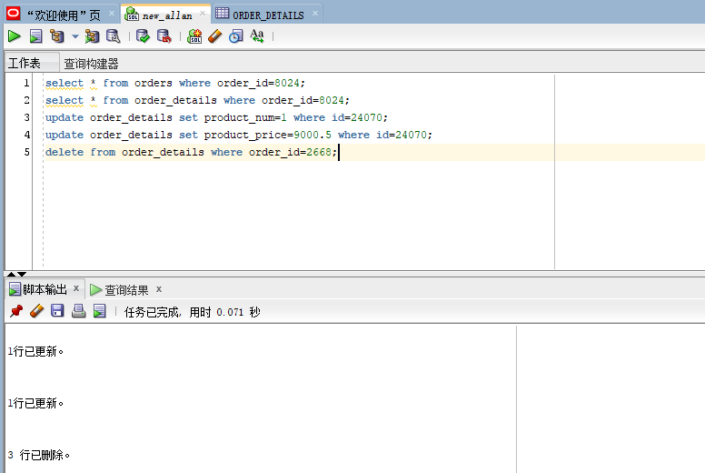

# 实验4：对象管理

## 实验目的：
了解Oracle表和视图的概念，学习使用SQL语句Create Table创建表，学习Select语句插入，修改，删除以及查询数据，学习使用SQL语句创建视图，学习部分存储过程和触发器的使用。

## 用户名：new_allan

#### 建表过程


#### 从orders表中查询任一个order_id
```SQL
select * from orders where order_id=8024;
```


#### 从order_details表中查询该order_id的相关信息
```SQL
select * from order_details where order_id=8024;
```


#### 对该order_id进行验证


从图中可知order_details表中的product_price * product_num的总数和等于该order_id的trade_receivable,所以验证结果成功

#### 更新指定id在order_details表中的product_num值
```SQL
update order_details set product_num=1 where id=24070;
```
##### 执行结果


##### 查看更新后的order_id = 8024的表数据


#### 更新指定id在order_details表中的product_price值
```SQL
update order_details set product_price=9000.5 where id=24070;
```
##### 执行结果


##### 查看更新后的order_id = 8024的表数据


### 对更改后的数据进行再次验证

#### 验证结果展示


#### 由表中可知验证结果正确

### 删除order_details表中的数据
```SQL
delete from order_details where order_id=2668;
```
#### 执行结果


### 向order_details表中插入数据
```SQL
insert into order_details values (300001,8022,'allan',1,3829.72);
```
#### 执行结果


### 查询插入的数据
```SQL
SELECT * from order_details where id=300001;
```
#### 执行结果


## 查询数据
### 1、查询某个员工的信息
```SQL
SELECT * from employees where employee_id=11;
```
#### 执行结果


### 2、递归查询某个员工及其所有下属，子下属员工。
### 查询某个员工的信息
```SQL
SELECT * FROM employees START WITH EMPLOYEE_ID = 11 CONNECT BY PRIOR EMPLOYEE_ID = MANAGER_ID;
```
#### 执行结果


### 3、查询订单表，并且包括订单的订单应收货款: Trade_Receivable= sum(订单详单表.ProductNum*订单详单表.ProductPrice)- Discount。
```SQL
SELECT
order_id,
pay-discount as Trade_Receivable
from
    (select
        orders.order_id as order_id,
        ORDERS.DISCOUNT as discount,
        sum(PRODUCT_NUM*PRODUCT_PRICE) as pay
        from ORDER_DETAILS 
        inner join ORDERS on(orders.order_id=order_details.order_id) 
        group by orders.order_id, ORDERS.DISCOUNT
);
```
#### 执行结果


### 4、查询订单详表，要求显示订单的客户名称和客户电话，产品类型用汉字描述。
```SQL
select o.CUSTOMER_NAME as "顾客名称", o.CUSTOMER_TEL as "顾客电话", od.PRODUCT_NAME as "产品类型"
from ORDERS o, ORDER_DETAILS od
where o.order_id = od.order_id;
```
#### 执行结果


### 5、查询出所有空订单，即没有订单详单的订单。
```SQL
select * from orders where orders.order_id not in(select order_id from order_details);
```
#### 执行结果


### 6、查询部门表，同时显示部门的负责人姓名。
```SQL
select DEPARTMENT_NAME as "部门",MANAGER_ID as "部门负责人" 
from DEPARTMENTS d,EMPLOYEES e
where d.DEPARTMENT_ID=e.DEPARTMENT_ID;
```
#### 执行结果


### 7、查询部门表，统计每个部门的销售总金额。
```SQL
select DEPARTMENT_NAME,SUM(o.Trade_Receivable)AS "销售总金额"
from DEPARTMENTS d,EMPLOYEES e,ORDERS o
where d.DEPARTMENT_ID=e.DEPARTMENT_ID and e.EMPLOYEE_ID=o.EMPLOYEE_ID group by DEPARTMENT_NAME;
```
#### 执行结果

