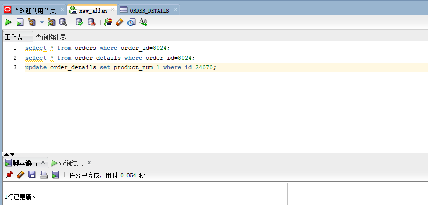

# 实验4：对象管理

## 实验目的：
了解Oracle表和视图的概念，学习使用SQL语句Create Table创建表，学习Select语句插入，修改，删除以及查询数据，学习使用SQL语句创建视图，学习部分存储过程和触发器的使用。

## 用户名：new_allan

#### 建表过程


#### 从orders表中查询任一个order_id
```SQL
select * from orders where order_id=8024;
```


#### 从order_details表中查询该order_id的相关信息
```SQL
select * from order_details where order_id=8024;
```


#### 对该order_id进行验证


从图中可知order_details表中的product_price * product_num的总数和等于该order_id的trade_receivable,所以验证结果成功

#### 更新指定id在order_details表中的product_num值
```SQL
update order_details set product_num=1 where id=24070;
```
##### 执行结果


##### 查看更新后的order_id = 8024的表数据


#### 更新指定id在order_details表中的product_price值
```SQL
update order_details set product_price=9000.5 where id=24070;
```
##### 执行结果


##### 查看更新后的order_id = 8024的表数据


### 对更改后的数据进行再次验证

#### 验证结果展示


#### 由表中可知验证结果正确

### 删除order_details表中的数据
```SQL
delete from order_details where order_id=2668;
```
#### 执行结果


### 向order_details表中插入数据
```SQL
insert into order_details values (300001,8022,'allan',1,3829.72);
```
#### 执行结果


### 查询插入的数据
```SQL
SELECT * from order_details where id=300001;
```
#### 执行结果


